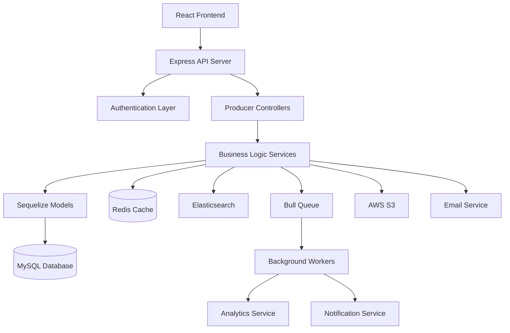
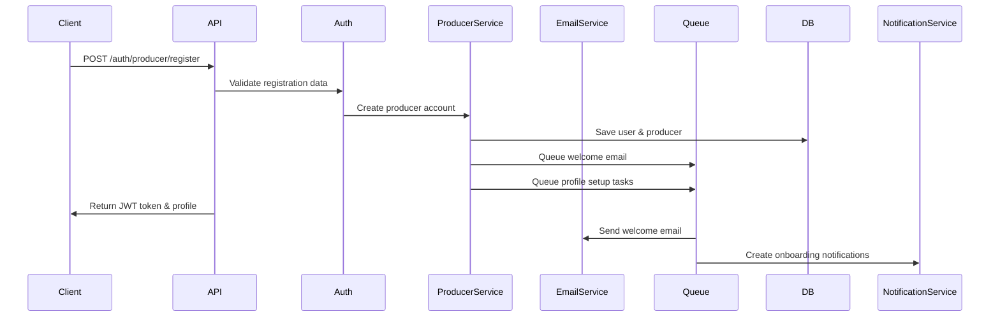
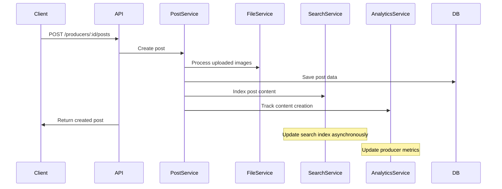
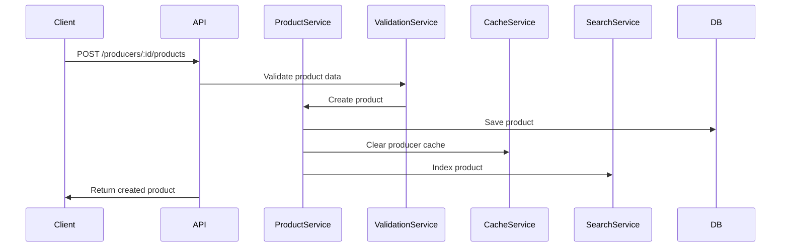
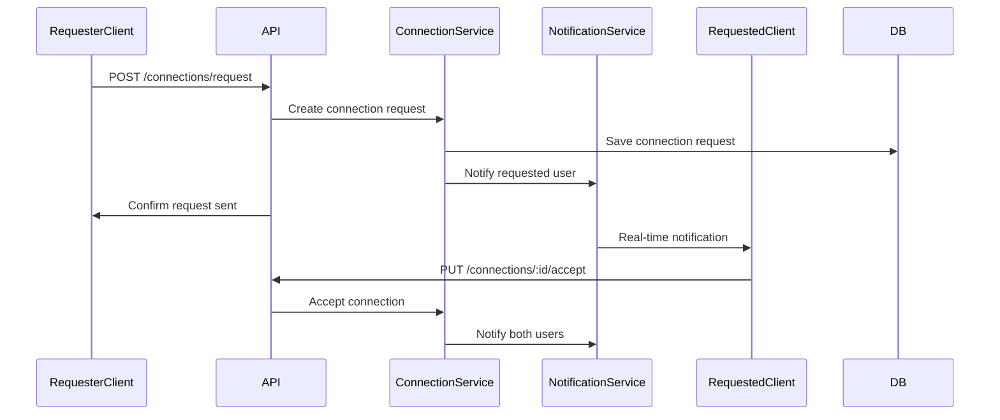

# Producer Integration & Data Flow Documentation

## Overview
This document describes the data flow, integration patterns, and system interactions for the Producer functionality in the HelaTrade platform. It covers how producers interact with other system components, external services, and data flow patterns.

## Table of Contents
1. [System Architecture](#system-architecture)
2. [Data Flow Patterns](#data-flow-patterns)
3. [Integration Layers](#integration-layers)
4. [Event-Driven Architecture](#event-driven-architecture)
5. [External Service Integrations](#external-service-integrations)
6. [Caching Strategy](#caching-strategy)
7. [Search Integration](#search-integration)
8. [Analytics Pipeline](#analytics-pipeline)
9. [File Upload & Storage](#file-upload--storage)
10. [Error Handling & Monitoring](#error-handling--monitoring)

---

## System Architecture

### High-Level Architecture


### Component Layers
```
┌─────────────────────────────────────────┐
│           Presentation Layer            │
│     (React Components, Pages)           │
└─────────────────────────────────────────┘
┌─────────────────────────────────────────┐
│            API Gateway Layer            │
│     (Express Routes, Middleware)        │
└─────────────────────────────────────────┘
┌─────────────────────────────────────────┐
│          Business Logic Layer           │
│  (Controllers, Services, Validators)    │
└─────────────────────────────────────────┘
┌─────────────────────────────────────────┐
│            Data Access Layer            │
│    (Models, Repositories, Queries)     │
└─────────────────────────────────────────┘
┌─────────────────────────────────────────┐
│           Infrastructure Layer          │
│  (Database, Cache, Storage, Queues)     │
└─────────────────────────────────────────┘
```

---

## Data Flow Patterns

### 1. Producer Registration Flow


### 2. Content Publishing Flow


### 3. Product Management Flow


### 4. Connection Request Flow


---

## Integration Layers

### 1. Controller Layer
```javascript
// src/controllers/producerController.js
class ProducerController {
  static async createProducer(req, res, next) {
    try {
      // Input validation
      const validatedData = await ProducerValidator.validateCreate(req.body)
      
      // Business logic
      const producer = await ProducerService.createProducer(validatedData, req.user)
      
      // Response formatting
      res.status(201).json({
        success: true,
        data: producer.toPublicJSON()
      })
    } catch (error) {
      next(error)
    }
  }

  static async updateProducer(req, res, next) {
    try {
      const { id } = req.params
      const updates = await ProducerValidator.validateUpdate(req.body)
      
      // Authorization check
      await AuthorizationService.canEditProducer(req.user, id)
      
      const producer = await ProducerService.updateProducer(id, updates)
      
      res.json({
        success: true,
        data: producer.toOwnerJSON()
      })
    } catch (error) {
      next(error)
    }
  }
}
```

### 2. Service Layer
```javascript
// src/services/producerService.js
class ProducerService {
  static async createProducer(data, user) {
    const transaction = await sequelize.transaction()
    
    try {
      // Create producer
      const producer = await Producer.create({
        ...data,
        userId: user.id
      }, { transaction })
      
      // Create related data
      await this.createProducerCategories(producer.id, data.categories, transaction)
      await this.createDefaultBusinessHours(producer.id, transaction)
      
      // Queue background tasks
      await QueueService.add('producer-welcome', {
        producerId: producer.id,
        email: user.email
      })
      
      await transaction.commit()
      
      // Update search index
      await SearchService.indexProducer(producer)
      
      return producer
    } catch (error) {
      await transaction.rollback()
      throw error
    }
  }

  static async updateProducer(id, updates) {
    const producer = await Producer.findByPk(id)
    if (!producer) {
      throw new NotFoundError('Producer not found')
    }

    // Update producer
    await producer.update(updates)
    
    // Handle related updates
    if (updates.categories) {
      await this.updateProducerCategories(id, updates.categories)
    }
    
    // Clear cache
    await CacheService.clearProducerCache(id)
    
    // Update search index
    await SearchService.updateProducerIndex(producer)
    
    return producer
  }
}
```

### 3. Repository Layer
```javascript
// src/repositories/producerRepository.js
class ProducerRepository {
  static async findByIdWithRelations(id) {
    return Producer.findByPk(id, {
      include: [
        'user',
        'categories', 
        'certifications',
        'specialties',
        'languages',
        'businessHours',
        'socialMedia'
      ]
    })
  }

  static async findByCategory(categoryId, options = {}) {
    return Producer.findAll({
      include: [{
        model: Category,
        as: 'categories',
        where: { id: categoryId },
        through: { attributes: [] }
      }],
      where: { verified: true },
      order: [['featured', 'DESC'], ['rating', 'DESC']],
      ...options
    })
  }

  static async searchProducers(query, filters = {}) {
    const whereClause = this.buildSearchWhereClause(query, filters)
    
    return Producer.findAndCountAll({
      where: whereClause,
      include: ['categories', 'user'],
      order: this.buildSearchOrder(filters.sort),
      offset: (filters.page - 1) * filters.limit,
      limit: filters.limit
    })
  }

  static buildSearchWhereClause(query, filters) {
    const conditions = []
    
    if (query) {
      conditions.push({
        [Op.or]: [
          { businessName: { [Op.like]: `%${query}%` } },
          { description: { [Op.like]: `%${query}%` } }
        ]
      })
    }
    
    if (filters.location) {
      conditions.push({ location: { [Op.like]: `%${filters.location}%` } })
    }
    
    if (filters.verified !== undefined) {
      conditions.push({ verified: filters.verified })
    }
    
    return { [Op.and]: conditions }
  }
}
```

---

## Event-Driven Architecture

### 1. Event System
```javascript
// src/events/eventEmitter.js
const EventEmitter = require('events')

class AppEventEmitter extends EventEmitter {
  constructor() {
    super()
    this.setupProducerEvents()
  }

  setupProducerEvents() {
    // Producer events
    this.on('producer.created', this.handleProducerCreated.bind(this))
    this.on('producer.verified', this.handleProducerVerified.bind(this))
    this.on('producer.updated', this.handleProducerUpdated.bind(this))
    
    // Content events
    this.on('post.created', this.handlePostCreated.bind(this))
    this.on('post.liked', this.handlePostLiked.bind(this))
    this.on('post.commented', this.handlePostCommented.bind(this))
    
    // Connection events
    this.on('connection.requested', this.handleConnectionRequested.bind(this))
    this.on('connection.accepted', this.handleConnectionAccepted.bind(this))
  }

  async handleProducerCreated(data) {
    const { producer, user } = data
    
    // Send welcome email
    await EmailService.sendProducerWelcome(producer, user)
    
    // Create onboarding activities
    await ActivityService.createOnboardingActivities(producer.id)
    
    // Index in search
    await SearchService.indexProducer(producer)
  }

  async handleProducerVerified(data) {
    const { producer } = data
    
    // Send verification email
    await EmailService.sendVerificationApproval(producer)
    
    // Update search index with boost
    await SearchService.updateProducerIndex(producer)
    
    // Create notification
    await NotificationService.create({
      userId: producer.userId,
      type: 'producer_verified',
      message: 'Your producer account has been verified!'
    })
  }
}

module.exports = new AppEventEmitter()
```

### 2. Event Handlers
```javascript
// src/services/eventHandlers/producerEventHandler.js
class ProducerEventHandler {
  static async onProducerCreated(producer) {
    // Update producer stats
    await AnalyticsService.incrementCounter('producers.created')
    
    // Add to recommendation engine
    await RecommendationService.addProducer(producer)
    
    // Setup default preferences
    await PreferenceService.createDefaults(producer.userId)
  }

  static async onProducerUpdated(producer, changes) {
    // Clear related caches
    await CacheService.clearProducerRelatedCaches(producer.id)
    
    // Update search index if relevant fields changed
    const searchRelevantFields = ['businessName', 'description', 'categories', 'location']
    if (searchRelevantFields.some(field => field in changes)) {
      await SearchService.updateProducerIndex(producer)
    }
    
    // Notify connections if public info changed
    if ('businessName' in changes || 'avatar' in changes) {
      await NotificationService.notifyConnections(producer.id, 'producer_updated')
    }
  }

  static async onPostCreated(post) {
    // Update producer post count
    await Producer.increment('totalPosts', { where: { id: post.producerId } })
    
    // Add to trending algorithm
    await TrendingService.addPost(post)
    
    // Notify followers
    await NotificationService.notifyFollowers(post.producerId, 'new_post', post)
  }
}
```

---

## External Service Integrations

### 1. Email Service Integration
```javascript
// src/services/emailService.js
class EmailService {
  static async sendProducerWelcome(producer, user) {
    const template = 'producer-welcome'
    const data = {
      businessName: producer.businessName,
      ownerName: producer.ownerName,
      loginUrl: `${config.frontend.url}/login`,
      dashboardUrl: `${config.frontend.url}/producer/dashboard`,
      supportEmail: config.email.support
    }

    return this.send({
      to: user.email,
      subject: `Welcome to HelaTrade, ${producer.businessName}!`,
      template,
      data
    })
  }

  static async sendVerificationApproval(producer) {
    const template = 'producer-verified'
    const data = {
      businessName: producer.businessName,
      verificationBadge: true,
      featuresUrl: `${config.frontend.url}/features`,
      dashboardUrl: `${config.frontend.url}/producer/dashboard`
    }

    return this.send({
      to: producer.user.email,
      subject: 'Your Producer Account is Now Verified!',
      template,
      data
    })
  }

  static async sendConnectionNotification(connection) {
    const requester = await connection.getRequester()
    const requested = await connection.getRequested()

    const template = 'connection-request'
    const data = {
      requesterName: requester.businessName || requester.name,
      message: connection.message,
      acceptUrl: `${config.frontend.url}/connections/requests`,
      profileUrl: `${config.frontend.url}/producers/${requester.id}`
    }

    return this.send({
      to: requested.email,
      subject: `New Connection Request from ${requester.businessName}`,
      template,
      data
    })
  }
}
```

### 2. File Storage Integration
```javascript
// src/services/fileService.js
class FileService {
  static async uploadProducerAvatar(file, producerId) {
    // Validate file
    this.validateImageFile(file)
    
    // Generate unique filename
    const filename = `producers/${producerId}/avatar_${Date.now()}.${this.getFileExtension(file)}`
    
    // Resize and optimize
    const optimizedFile = await this.optimizeImage(file, {
      width: 200,
      height: 200,
      quality: 80
    })
    
    // Upload to S3
    const result = await S3Service.upload({
      key: filename,
      body: optimizedFile,
      contentType: file.mimetype,
      acl: 'public-read'
    })
    
    return {
      url: result.Location,
      key: result.Key
    }
  }

  static async uploadProductImages(files, productId) {
    const uploadPromises = files.map(async (file, index) => {
      const filename = `products/${productId}/image_${index}_${Date.now()}.${this.getFileExtension(file)}`
      
      // Create multiple sizes
      const sizes = await Promise.all([
        this.optimizeImage(file, { width: 800, height: 600, quality: 85 }),
        this.optimizeImage(file, { width: 400, height: 300, quality: 80 }),
        this.optimizeImage(file, { width: 200, height: 150, quality: 75 })
      ])

      const uploads = await Promise.all(sizes.map((optimized, sizeIndex) => {
        const sizeNames = ['large', 'medium', 'small']
        const sizeFilename = filename.replace('.', `_${sizeNames[sizeIndex]}.`)
        
        return S3Service.upload({
          key: sizeFilename,
          body: optimized,
          contentType: file.mimetype,
          acl: 'public-read'
        })
      }))

      return {
        original: file.originalname,
        large: uploads[0].Location,
        medium: uploads[1].Location,
        small: uploads[2].Location
      }
    })

    return Promise.all(uploadPromises)
  }
}
```

### 3. Payment Integration (Future)
```javascript
// src/services/paymentService.js
class PaymentService {
  static async createSubscription(producerId, plan) {
    const producer = await Producer.findByPk(producerId, { include: 'user' })
    
    // Create Stripe customer
    const customer = await stripe.customers.create({
      email: producer.user.email,
      name: producer.businessName,
      metadata: {
        producerId: producer.id,
        userType: 'producer'
      }
    })

    // Create subscription
    const subscription = await stripe.subscriptions.create({
      customer: customer.id,
      items: [{ price: plan.stripePriceId }],
      trial_period_days: plan.trialDays || 0
    })

    // Save subscription details
    await ProducerSubscription.create({
      producerId: producer.id,
      stripeCustomerId: customer.id,
      stripeSubscriptionId: subscription.id,
      plan: plan.name,
      status: subscription.status
    })

    return subscription
  }
}
```

---

## Caching Strategy

### 1. Cache Layers
```javascript
// src/services/cacheService.js
class CacheService {
  // Cache keys
  static getProducerKey(id) {
    return `producer:${id}`
  }

  static getProducerProfileKey(id) {
    return `producer:${id}:profile`
  }

  static getProducerAnalyticsKey(id, timeRange) {
    return `producer:${id}:analytics:${timeRange}`
  }

  static getProducerSearchKey(query, filters) {
    const filterStr = JSON.stringify(filters)
    return `search:producers:${Buffer.from(query + filterStr).toString('base64')}`
  }

  // Cache operations
  static async getProducer(id) {
    const key = this.getProducerKey(id)
    let producer = await redis.get(key)
    
    if (!producer) {
      producer = await ProducerRepository.findByIdWithRelations(id)
      if (producer) {
        await redis.setex(key, 3600, JSON.stringify(producer)) // 1 hour
      }
    } else {
      producer = JSON.parse(producer)
    }
    
    return producer
  }

  static async cacheProducerAnalytics(id, timeRange, data) {
    const key = this.getProducerAnalyticsKey(id, timeRange)
    await redis.setex(key, 1800, JSON.stringify(data)) // 30 minutes
  }

  static async clearProducerCache(id) {
    const keys = [
      this.getProducerKey(id),
      this.getProducerProfileKey(id),
      `producer:${id}:analytics:*`,
      `search:producers:*` // Clear search caches
    ]
    
    await redis.del(keys)
  }
}
```

### 2. Cache Invalidation Strategy
```javascript
// Cache invalidation patterns
const cacheInvalidationRules = {
  'producer.updated': (data) => {
    CacheService.clearProducerCache(data.producerId)
    CacheService.clearSearchCaches() // Clear all search caches
  },
  
  'post.created': (data) => {
    CacheService.clearProducerAnalytics(data.producerId)
    CacheService.clearTrendingCache()
  },
  
  'connection.accepted': (data) => {
    CacheService.clearProducerAnalytics(data.requesterId)
    CacheService.clearProducerAnalytics(data.requestedId)
    CacheService.clearRecommendationCache(data.requesterId)
  }
}
```

---

## Search Integration

### 1. Elasticsearch Integration
```javascript
// src/services/searchService.js
class SearchService {
  static async indexProducer(producer) {
    const searchData = {
      id: producer.id,
      businessName: producer.businessName,
      description: producer.description,
      location: producer.location,
      province: producer.province,
      categories: producer.categories.map(c => ({
        id: c.id,
        name: c.name,
        slug: c.slug
      })),
      specialties: producer.specialties.map(s => s.specialty),
      verified: producer.verified,
      featured: producer.featured,
      rating: producer.rating,
      totalConnections: producer.totalConnections,
      createdAt: producer.createdAt,
      boost: producer.featured ? 2.0 : (producer.verified ? 1.5 : 1.0)
    }

    await elasticsearch.index({
      index: 'producers',
      id: producer.id,
      body: searchData
    })
  }

  static async searchProducers(query, filters = {}) {
    const searchQuery = {
      bool: {
        must: [],
        filter: [],
        should: []
      }
    }

    // Text search
    if (query) {
      searchQuery.bool.must.push({
        multi_match: {
          query,
          fields: [
            'businessName^3',
            'description^2',
            'specialties^2',
            'categories.name^2',
            'location^1'
          ],
          type: 'best_fields',
          fuzziness: 'AUTO'
        }
      })
    }

    // Filters
    if (filters.category) {
      searchQuery.bool.filter.push({
        term: { 'categories.id': filters.category }
      })
    }

    if (filters.location) {
      searchQuery.bool.filter.push({
        match: { location: filters.location }
      })
    }

    if (filters.verified !== undefined) {
      searchQuery.bool.filter.push({
        term: { verified: filters.verified }
      })
    }

    // Boost featured producers
    searchQuery.bool.should.push({
      term: { featured: { value: true, boost: 2.0 } }
    })

    const result = await elasticsearch.search({
      index: 'producers',
      body: {
        query: searchQuery,
        sort: this.buildSortClause(filters.sort),
        from: (filters.page - 1) * filters.limit,
        size: filters.limit,
        highlight: {
          fields: {
            businessName: {},
            description: {}
          }
        }
      }
    })

    return {
      results: result.body.hits.hits.map(hit => ({
        ...hit._source,
        highlights: hit.highlight
      })),
      total: result.body.hits.total.value,
      took: result.body.took
    }
  }
}
```

### 2. Search Analytics
```javascript
// Track search queries for analytics
class SearchAnalyticsService {
  static async trackSearch(query, filters, results, userId = null) {
    await SearchQuery.create({
      query,
      filters: JSON.stringify(filters),
      resultCount: results.total,
      userId,
      executionTime: results.took,
      createdAt: new Date()
    })
  }

  static async getPopularSearches(timeRange = '7days') {
    const startDate = moment().subtract(7, 'days').toDate()
    
    return SearchQuery.findAll({
      attributes: [
        'query',
        [sequelize.fn('COUNT', sequelize.col('id')), 'count']
      ],
      where: {
        createdAt: { [Op.gte]: startDate },
        query: { [Op.ne]: '' }
      },
      group: ['query'],
      order: [[sequelize.fn('COUNT', sequelize.col('id')), 'DESC']],
      limit: 10
    })
  }
}
```

---

## Analytics Pipeline

### 1. Real-time Analytics
```javascript
// src/services/analyticsService.js
class AnalyticsService {
  static async trackProducerView(producerId, viewerData) {
    // Store detailed view
    await AnalyticsView.create({
      viewableType: 'producer',
      viewableId: producerId,
      viewerId: viewerData.userId,
      ipAddress: viewerData.ip,
      userAgent: viewerData.userAgent,
      referrer: viewerData.referrer,
      sessionId: viewerData.sessionId
    })

    // Update counter (async)
    setImmediate(async () => {
      await Producer.increment('totalViews', { where: { id: producerId } })
    })

    // Update real-time metrics
    await redis.hincrby(`producer:${producerId}:metrics`, 'views', 1)
    await redis.expire(`producer:${producerId}:metrics`, 86400) // 24 hours
  }

  static async getProducerAnalytics(producerId, timeRange) {
    const cacheKey = CacheService.getProducerAnalyticsKey(producerId, timeRange)
    let analytics = await redis.get(cacheKey)

    if (!analytics) {
      analytics = await this.calculateProducerAnalytics(producerId, timeRange)
      await redis.setex(cacheKey, 1800, JSON.stringify(analytics)) // 30 minutes
    } else {
      analytics = JSON.parse(analytics)
    }

    return analytics
  }

  static async calculateProducerAnalytics(producerId, timeRange) {
    const startDate = this.getStartDateForRange(timeRange)
    
    const [views, likes, comments, connections, posts, products] = await Promise.all([
      this.getViewsAnalytics(producerId, startDate),
      this.getLikesAnalytics(producerId, startDate),
      this.getCommentsAnalytics(producerId, startDate),
      this.getConnectionsAnalytics(producerId, startDate),
      this.getPostsAnalytics(producerId, startDate),
      this.getProductsAnalytics(producerId, startDate)
    ])

    return {
      overview: {
        totalViews: views.total,
        totalLikes: likes.total,
        totalComments: comments.total,
        totalConnections: connections.total,
        viewsChange: views.change,
        likesChange: likes.change,
        commentsChange: comments.change,
        connectionsChange: connections.change
      },
      viewsOverTime: views.overTime,
      topPosts: posts.top,
      topProducts: products.top,
      engagement: this.calculateEngagementScore(views, likes, comments)
    }
  }
}
```

### 2. Batch Analytics Processing
```javascript
// Background job for analytics processing
class AnalyticsProcessor {
  static async processDaily() {
    console.log('Starting daily analytics processing...')
    
    // Update producer rankings
    await this.updateProducerRankings()
    
    // Calculate trending scores
    await this.updateTrendingScores()
    
    // Generate daily reports
    await this.generateDailyReports()
    
    // Clean old analytics data
    await this.cleanOldAnalyticsData()
  }

  static async updateProducerRankings() {
    const producers = await Producer.findAll({
      attributes: ['id'],
      where: { verified: true }
    })

    for (const producer of producers) {
      const score = await this.calculateProducerScore(producer.id)
      await ProducerRanking.upsert({
        producerId: producer.id,
        score,
        rank: 0, // Will be calculated after all scores are updated
        date: new Date()
      })
    }

    // Update ranks based on scores
    await this.updateRanks()
  }

  static async calculateProducerScore(producerId) {
    const analytics = await AnalyticsService.getProducerAnalytics(producerId, '30days')
    
    const score = (
      (analytics.overview.totalViews * 0.1) +
      (analytics.overview.totalLikes * 2) +
      (analytics.overview.totalComments * 5) +
      (analytics.overview.totalConnections * 10) +
      (analytics.engagement * 100)
    )

    return Math.round(score)
  }
}
```

---

## Error Handling & Monitoring

### 1. Error Handling Strategy
```javascript
// src/middleware/errorHandler.js
class ErrorHandler {
  static handle(error, req, res, next) {
    // Log error
    logger.error('API Error:', {
      error: error.message,
      stack: error.stack,
      url: req.url,
      method: req.method,
      userId: req.user?.id,
      ip: req.ip
    })

    // Handle different error types
    if (error instanceof ValidationError) {
      return res.status(422).json({
        success: false,
        error: {
          code: 'VALIDATION_ERROR',
          message: error.message,
          details: error.details
        }
      })
    }

    if (error instanceof NotFoundError) {
      return res.status(404).json({
        success: false,
        error: {
          code: 'NOT_FOUND',
          message: error.message
        }
      })
    }

    if (error instanceof AuthorizationError) {
      return res.status(403).json({
        success: false,
        error: {
          code: 'FORBIDDEN',
          message: error.message
        }
      })
    }

    // Default server error
    res.status(500).json({
      success: false,
      error: {
        code: 'INTERNAL_ERROR',
        message: 'An internal server error occurred'
      }
    })
  }
}
```

### 2. Monitoring & Alerting
```javascript
// src/services/monitoringService.js
class MonitoringService {
  static async trackApiCall(req, res, duration) {
    const metrics = {
      endpoint: `${req.method} ${req.route?.path || req.url}`,
      statusCode: res.statusCode,
      duration,
      userId: req.user?.id,
      userType: req.user?.userType,
      timestamp: new Date()
    }

    // Send to monitoring service
    await this.sendMetrics('api.call', metrics)

    // Alert on errors
    if (res.statusCode >= 500) {
      await this.sendAlert('api.error', {
        ...metrics,
        error: 'Server error occurred'
      })
    }

    // Alert on slow responses
    if (duration > 5000) { // 5 seconds
      await this.sendAlert('api.slow', {
        ...metrics,
        warning: 'Slow API response'
      })
    }
  }

  static async trackBusinessMetric(metric, value, tags = {}) {
    await this.sendMetrics(metric, {
      value,
      tags,
      timestamp: new Date()
    })
  }

  static async sendAlert(type, data) {
    // Send to Slack/email/PagerDuty
    if (process.env.NODE_ENV === 'production') {
      await SlackService.sendAlert(type, data)
    }
  }
}
```

### 3. Health Checks
```javascript
// src/routes/health.js
class HealthCheckController {
  static async checkHealth(req, res) {
    const checks = {
      database: await this.checkDatabase(),
      redis: await this.checkRedis(),
      elasticsearch: await this.checkElasticsearch(),
      s3: await this.checkS3(),
      email: await this.checkEmailService()
    }

    const isHealthy = Object.values(checks).every(check => check.status === 'healthy')

    res.status(isHealthy ? 200 : 503).json({
      status: isHealthy ? 'healthy' : 'unhealthy',
      timestamp: new Date().toISOString(),
      checks
    })
  }

  static async checkDatabase() {
    try {
      await sequelize.authenticate()
      return { status: 'healthy', message: 'Database connection successful' }
    } catch (error) {
      return { status: 'unhealthy', message: error.message }
    }
  }

  static async checkRedis() {
    try {
      await redis.ping()
      return { status: 'healthy', message: 'Redis connection successful' }
    } catch (error) {
      return { status: 'unhealthy', message: error.message }
    }
  }
}
```

This comprehensive integration documentation provides a complete guide to how the Producer functionality integrates with other system components, external services, and data flow patterns. It serves as a reference for understanding the system architecture and implementing new features or debugging issues.